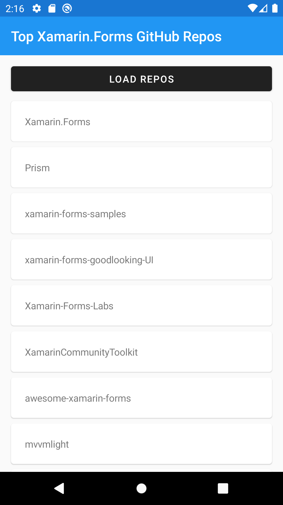
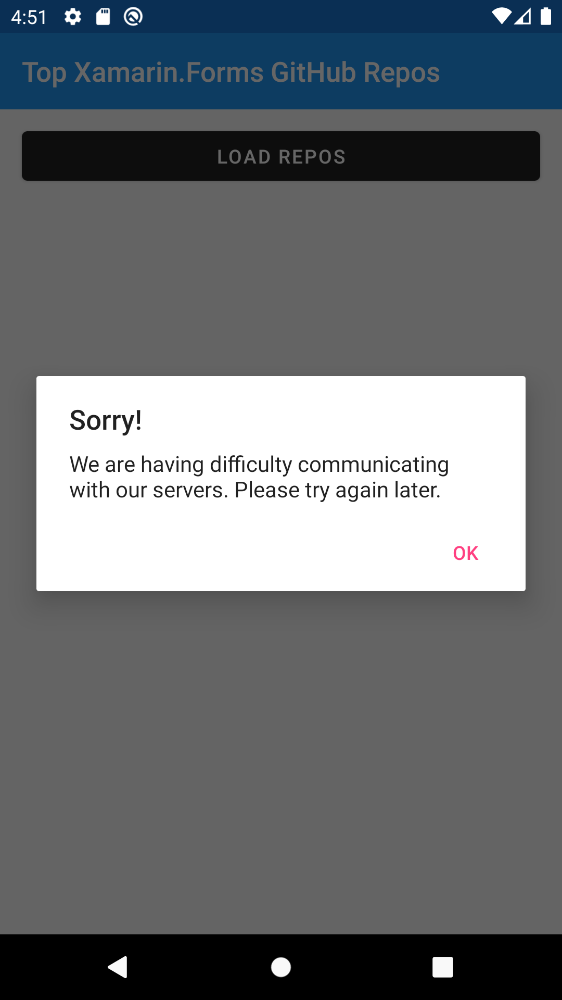
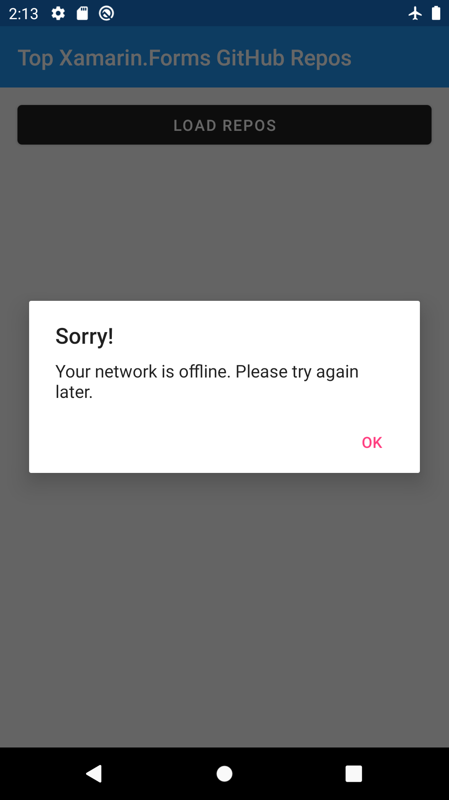

# xamarin.forms-remote-data-study

This repo contains a Xamarin.Forms application that retrieves and displays a list of GitHub repos. It is based on learnings from:

1. [Working with Remote Data in Xamarin.Forms Applications](https://www.pluralsight.com/courses/remote-data-xamarin-forms-applications)
2. [Getting Started with Android Development](https://www.pluralsight.com/courses/getting-started-android-development).



## Topics Studied

- Making remote web service calls with [RestSharp](https://restsharp.dev)
- Creating remote data models and deserializing with [Json.NET](https://www.newtonsoft.com/json)
- Adding resiliency (request retry logic) with [Polly](https://github.com/App-vNext/Polly)
- Reducing load time by caching with [Akavache](https://github.com/reactiveui/Akavache)
- Handling errors gracefully with [alert pop-ups](https://docs.microsoft.com/en-us/xamarin/xamarin-forms/user-interface/pop-ups)
- Checking network availability with [Xamarin.Essentials: Connectivity](https://docs.microsoft.com/en-us/xamarin/essentials/connectivity?tabs=android)

## Notes

### Displaying Errors

#### HTTP Error

To see how the app handles an HTTP error:

1. Set the RestClient baseUrl to a nonexistent url (e.g. https://api.github)

```c#
var restClient = new RestClient("https://api.github");
```

2. Restart the app
3. Tap "LOAD REPOS"



#### Network Offline

To see how the app handles a network offline error, turn on airplane mode and tap "LOAD REPOS".


