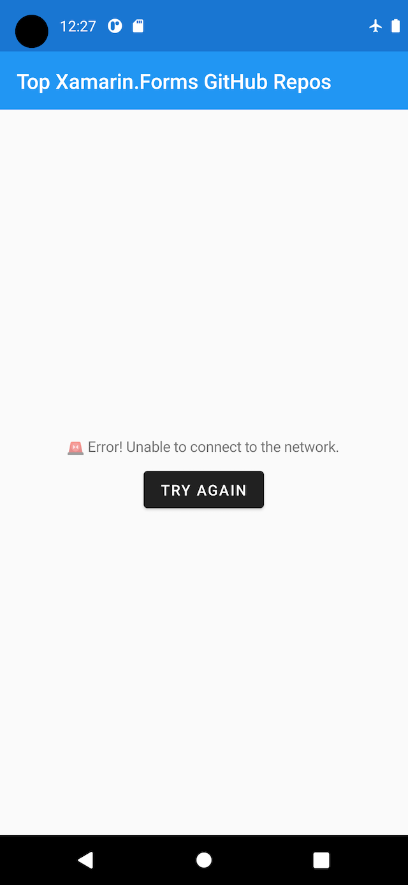

# Xamarin.Forms Remote Data Study

The purpose of the repository is to study remote data integrations in Xamarin.Forms. This repo contains a Xamarin.Forms application that retrieves and displays a list of GitHub repos.

## Topics Studied

- Making remote web service calls with [RestSharp](https://restsharp.dev)
- Creating remote data models and deserializing with [Json.NET](https://www.newtonsoft.com/json)
- Adding resiliency (request retry logic) with [Polly](https://github.com/App-vNext/Polly)
- Reducing load time by caching with [Akavache](https://github.com/reactiveui/Akavache)
- Handling network loading, done, and error states

## Architecture Diagram

## Displaying Error States

To simulate a network error, turn on airplane mode on your phone or emulator and restart the app.

## See Also

- [Working with Remote Data in Xamarin.Forms Applications](https://www.pluralsight.com/courses/remote-data-xamarin-forms-applications)
- [Xamarin.Forms Web Service Tutorial](https://docs.microsoft.com/en-us/xamarin/get-started/tutorials/web-service/?tabs=vswin)
- [Consume a RESTful web service](https://docs.microsoft.com/en-us/xamarin/xamarin-forms/data-cloud/web-services/rest)
- [Getting Started with Android Development](https://www.pluralsight.com/courses/getting-started-android-development)
